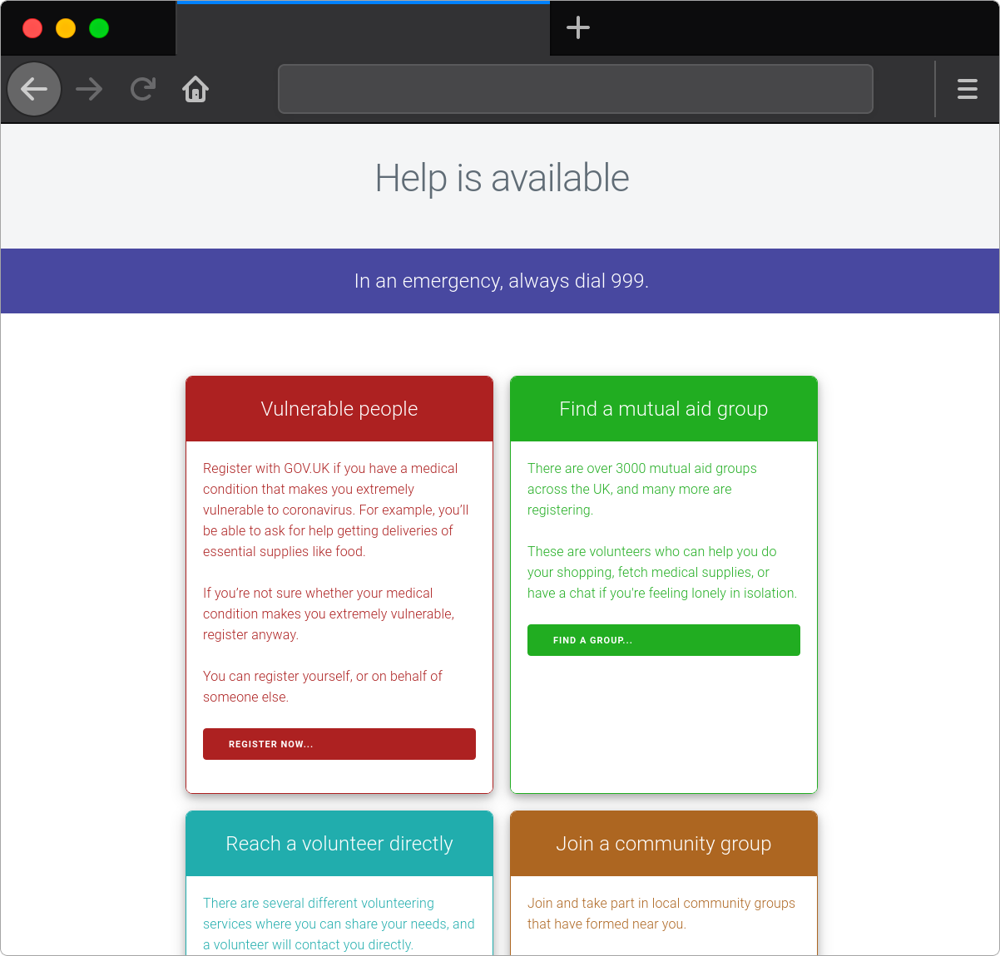

# help-is-available

This is the site at: [helpisavailable.org.uk](https://helpisavailable.org.uk)

## Developers

To modify this site:

* First, fork it on GitHub.
* Make modifications.
* Once ready, commit and push to GitHub.
* Submit a pull request with your commit.

